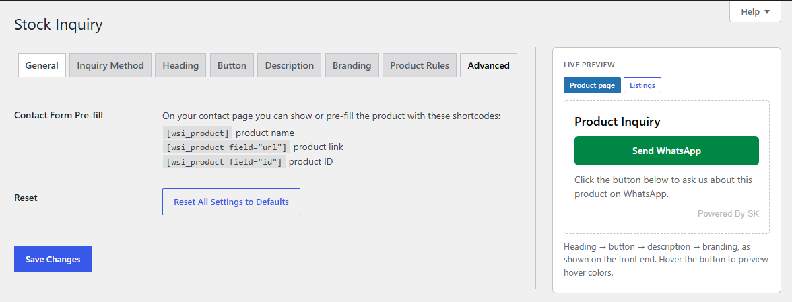
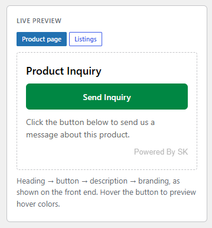
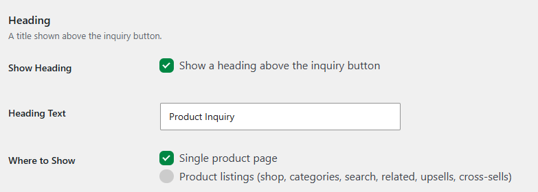
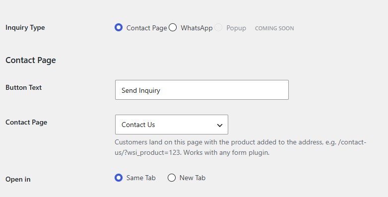
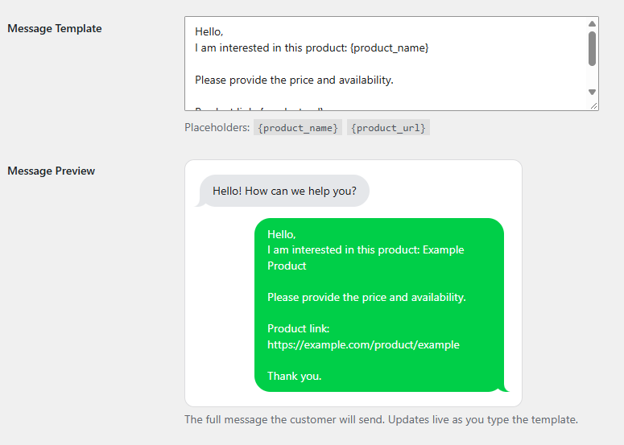
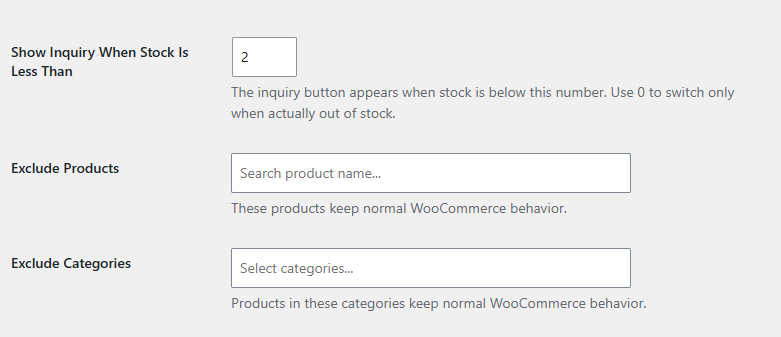

# WooCommerce Stock Inquiry

A lightweight, free, open-source WooCommerce plugin that replaces **Add to Cart** with a customizable **Send Inquiry** button when a product reaches a configurable stock threshold. Products are never hidden and WooCommerce stock data is never changed.

> No shortcode required. Works with WooCommerce archives, single product pages and Elementor product layouts.

| Stock (threshold 5) | Action |
|---:|---|
| 10 / 6 / 5 | Add to Cart |
| 4 / 1 / 0 | Send Inquiry |

When a product is restocked, Add to Cart returns automatically (the decision is computed from the live product on every render).

### Main Overview

The plugin replaces the Add to Cart button with a Send Inquiry button once a product's stock drops to the configured threshold — while keeping every product visible and all stock data untouched.

## Features

- Stock-threshold based inquiry button (backorders and unmanaged stock respected)
- Inquiry methods: **Contact Page** (passes product via query string) and **WhatsApp** (pre-filled message with `{product_name}` / `{product_url}`)
- Popup method: planned for V2 (shown as "Coming Soon")
- Product and category exclusions
- Works on shop, category, search, related, upsells, cross-sells, single product, Elementor loop widgets
- Settings screen with per-element tabs and a sticky live preview

## Settings (WooCommerce → Stock Inquiry)

| Tab | Controls |
|---|---|
| General | Enable plugin, where the button is used |
| Inquiry Method | Contact Page / WhatsApp, button text, number, message template, **WhatsApp chat-bubble preview** |
| Heading | Toggle, text, where to show, font family, size, weight, color |
| Button | Font family, size, weight, padding, radius, border, colors (normal/hover), alignment, position |
| Description | Toggle, text per method, where to show, font family, size, color |
| Branding | Where to show, font family, font size, placement (no color) |
| Product Rules | Stock threshold, excluded products, excluded categories |
| Advanced | Contact form shortcodes, reset |

### Where to show

Heading, Description and Branding each have **Single product page** and **Product listings** switches. Default: the whole section (heading, button, description, branding) on the single product page, and only the button in listings.

### Live preview

The right-hand column is sticky on every tab and uses the same markup classes and CSS as the front end: heading → button → description → branding. Use the *Product page / Listings* switch to see what each location shows.

### Heading Options

Control the heading shown above the inquiry button — toggle it on or off, set the text, choose where it appears (single product page, product listings, or both), and fine-tune the font family, size, weight, and color.

### Contact Options

Configure how customers reach you when they submit an inquiry. Choose between the **Contact Page** method (which passes the product via query string) and **WhatsApp** (with a pre-filled message), set the button text, WhatsApp number, and message template.

### Message Template

Customize the message that is pre-filled when a customer sends an inquiry via WhatsApp. Use dynamic placeholders like `{product_name}` and `{product_url}` to personalize each message automatically.

### Exclude Products

Prevent the Send Inquiry button from appearing on specific products or entire categories. Excluded items will always keep the standard Add to Cart button, even when their stock drops below the threshold.

## Installation

1. Upload the ZIP at **Plugins → Add New Plugin → Upload Plugin** and activate (WooCommerce must be active).
2. Go to **WooCommerce → Stock Inquiry**, choose a method, save.

## Security

Capability checks, nonce-protected reset, allow-list sanitization for every setting (fonts, alignment, colors, numbers), escaped output, encoded URLs.

## Hooks

`wsi_needs_inquiry`, `wsi_supported_product_types`, `wsi_inquiry_methods`, `wsi_coming_soon_methods`, `wsi_admin_method_fields`, `wsi_show_stock_text`, `wsi_button_html` (receives `$html, $product, $link, $context`).

## License

GPL-2.0-or-later. See `LICENSE`.

Author: Shafiqur Rehman — Changelog in `CHANGELOG.md`.
